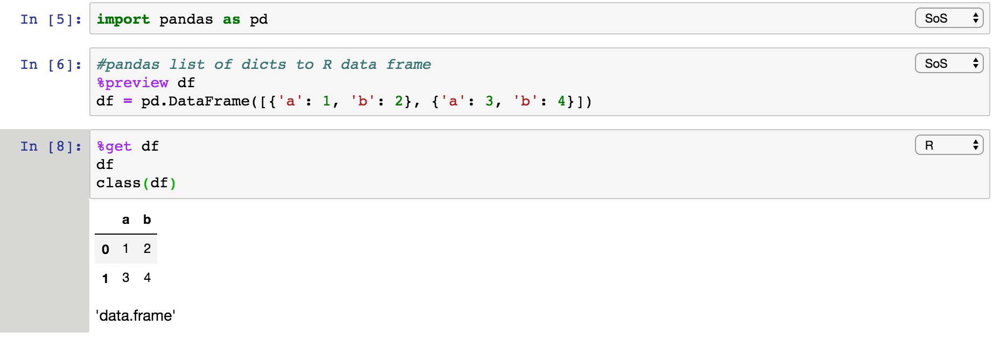

# Commands to remember
Katherine Keith

## LDA, topic models  
[Gensim wrapper of Mallet](https://radimrehurek.com/gensim/models/wrappers/ldamallet.html). 

[Helpful tutorial using this software.](https://www.machinelearningplus.com/nlp/topic-modeling-gensim-python/) 

## Sklearn 

### Grid search, cross validation 
```
from sklearn.model_selection import GridSearchCV
from sklearn.linear_model import LogisticRegression
from sklearn.metrics import log_loss, make_scorer


parameters = {'C': [1.0/2.0**reg for reg in np.arange(-12, 12)]}
lr = LogisticRegression(penalty='l1')
grid_search = GridSearchCV(lr, parameters, cv=10, refit=True, 
                           scoring=make_scorer(log_loss, greater_is_better=True))
grid_search.fit(X, y)
best_model = grid_search.best_estimator_
print(best_model)
print('Training mean accuracy=', best_model.score(X, y))
```

## Latex

Using Latex in sublime instructions: http://individual.utoronto.ca/dobronyi/latexsublime.html

### Use for comments 
```
\usepackage{color}
\newcommand{\kkcomment}[1]{\textcolor{red}{[#1 -KAK]}}
```
### Reduce space between bullets 
```
\begin{itemize}[noitemsep]
\itemsep0em
```

### Figures 

```
\usepackage{graphicx}
\begin{figure}[t]
\centering
\includegraphics[width=0.5\textwidth]{fig}
\caption{ XXX \label{XXX}}
\end{figure}
```

### Tables 

```
\usepackage{booktabs}
\begin{table}[t]
  \centering
      \begin{tabular}{lll}
      \toprule
      Relation         & Yes   & No    \\
      \toprule
      Institution      & 27045 & 15579 \\
      Place of birth   & 6992  & 2574 
  \end{tabular}
  \caption{XXX  \label{t:XXX}}
\end{table}
```
### Making tables pretty 
Add ragged right 
```
\usepackage{array}

#later on 
\begin{tabular}{c  >{\raggedright\arraybackslash}p{3cm}}
```

## Pytest 
Test a single function 
```
python -m pytest script.py -k "function name"
```

## Python

### Quick number of lines in a file 
```
num_lines = sum(1 for line in open('myfile.txt'))
```

### Python strings 
```
print("{0:<1} {1:<3}".format("blah1", "blah2")
```
left-align `<` 
center `^`
right-align  `>`

### Exceptions
Basic expection method that exists the program 
```
raise Exception('write your message here')
```

### Pandas select rows that have a column match 
```
new_df = old_df.loc[old_df['colm_name'] == 1]
```

### Boilerplate 
```
if __name__ == '__main__':
  main()
```

### Argparse 
```
parser = argparse.ArgumentParser()
parser.add_argument("input", help=".json file", type=str)
args = parser.parse_args()
```

### Making folders 
```
if not os.path.exists(folder): os.mkdir(folder)
```

### Dictionaries 
```
#sorts by largest value (Python2)  
sorted(d.items(), key=lambda (k, v): -v)

#sorting by descending value for Python3
sorted(d.items(), key=lambda kv: -kv[1])

#default dict of a default dict 
defaultdict(lambda : defaultdict(int))

#To check if a key is in a dictionary, the fastest way is  
if d.get(k) != None 
```

### Matplotlib 
On a server 
```
import matplotlib as mpl
mpl.use('Agg')
import matplotlib.pyplot as plt
```
With a Jupyter notebook
```
import matplotlib
import matplotlib.pyplot as plt
%matplotlib inline
```
Simple plot 
```
plt.plot(stats['loss_history'])
plt.xlabel('iteration')
plt.ylabel('training loss')
plt.title('Training Loss history')
plt.tight_layout()
plt.savefig('../../HW03-report/q2d', bbox_inches='tight')
plt.show()
```
Clearning plots (for example, when iterating through a loop): 
```
plt.clf()
plt.close()
```

### Parsing HTML tables with BeautifulSoup, save to csv  
```
import urllib, requests, json, time
from bs4 import BeautifulSoup

page_url = "INSERT_DESIRED_URL_HERE"
page = requests.get(page_url)
soup = BeautifulSoup(page.text, 'html.parser') 

fout = 'TEXT_HERE'
ww = open(fout, 'w')
for row in soup.find_all('tr'):
    row.find_all('td')
    cols = row.find_all('td')
    cols = ''.join([ele.text.strip()+',' for ele in cols])+'\n'
    ww.write(cols)
```

### Other 
Write to standard error when loading big files
```
sys.stderr.write(".")
```

## ssh
How to create ssh keys: https://superuser.com/questions/8077/how-do-i-set-up-ssh-so-i-dont-have-to-type-my-password

## Jupyter notebook 

```
#covert jupyter to .py file 
jupyter nbconvert --to script 1idvl.ipynb
```
### Open jupyter notebook from remote server locally
1. On remote, `jupyter notebook --port=9999`
2. On local, `ssh -NL $PORT:localhost:$PORT kkeith@hobbes.cs.umass.edu` where you specify `PORT=999` or whatever the port is on your remote. 
3. Manually open in a browser `http://localhost:9999/tree`

### Add images to Jupyter notebook
Change the cell type to markdown and then use 
```

```

### Using virtualenv within a jupyter notebook 

```
$ python -m venv projectname
$ source projectname/bin/activate
(venv) $ pip install ipykernel
(venv) $ ipython kernel install --user --name=projectname
```

Make sure that it is in the kernelspec list 
```
jupyter kernelspec list
```

Kernel -> Change kernel 

### Auto-reloading Jupyter Notebook 
```
%load_ext autoreload
%autoreload 2
```

### Using both Python and R within a single Jupyter notebook
 
1. Make sure you are using Python3 with anaconda. 
2. Make sure you have the latest version of R and install an R kernel. Within the R console run (instructions from here https://irkernel.github.io/installation/): 
```
install.packages('IRkernel')
IRkernel::installspec()
```
3. Follow the instructions to download SoS here: https://vatlab.github.io/sos-docs/running.html#content
```
pip install sos
pip install sos-notebook
pip install sos-r
python -m sos_notebook.install
```
4. Then follow the SoS examples and you should be able to run R and Python within the same Jupyter notebook. Trading data back and forth! 
https://vatlab.github.io/blog/post/sos-notebook/

Here is an example that I use often: list of dicts -> pandas dataframe (python) -> R dataframe using SoS 



## Linux/Unix 

### Vim 
Install supertab so you can tab complete in vim 
1. git clone the source directly https://vimawesome.com/plugin/supertab, use the "Pathogen" directions
2. Add the following to your .vimrc `:so ~/.vim/bundle/supertab/plugin/supertab.vim`

### Symbolic link
```
ln -s ORIGNIAL SYMLINK
```

### bash script
Make the date 
```
START=`date '+%m-%d-%H:%M'`
```

### sending emails with bash
```
mail -s "<<SUBJECT OF EMAIL>>" kkeith@cs.umass.edu < ${file_email_body}
```

### .bashrc
```
#Makes folders colored 
export LS_OPTIONS='--color=auto'
eval "$(dircolors -b)"
alias ls='ls $LS_OPTIONS'
```

### Awk 
```
#prints the third column 
awk '{ print $3 }’ yourfile.txt
```

### Parallel 
```
INDIR=/home/kkeith/dir/
GOLD=file.json
CORES=6
ls -1 $INDIR/* | parallel -v --dryrun "python pythonfile.py {}  $GOLD"
ls -1 $INDIR/* | parallel --eta -j$CORES "python getsentment.py {} $GOLD”
```

Multiple inputs
```
cat fileinput | parallel --colsep '\t' myprogram {1} {2} {1}_vs_{2}.result
```
In a for loop 
```
for day in {0..3}; do echo "${day}"; done | parallel -v --dryrun "python blah.py {}"
```


### Using a GUI on a remote server
https://www.macissues.com/2014/10/13/how-to-mount-a-remote-system-as-a-drive-using-ssh-in-os-x/
```
sshfs kkeith@hobbes.cs.umass.edu:/home/kkeith/ ~/mount/
umount -f ~/mount/
```

## Git / Github 

### Remove large files 
Removing a large file that you committed several commits ago but now can't push. (A lot of the filter-branch suggestions don't work for me in many cases) 
https://blog.ostermiller.org/git-remove-from-history

E.g. you have an error message: 
```
remote: error: File pytorch.zip is 510.96 MB; this exceeds GitHub Enterprise's file size limit of 100.00 MB
```
### Lazy git: add commit push in one function 
Save this in your .bashrc or equivalent 
```
function lgit(){
    #lazy git 
    #last argument is the commit message
    #all args before the last are the files you want to commit 

    #example::
    # lazygit 'blah.py' 'blah2.py' 'this is a test message'
    # --> commits files blah.py blah2.py 
    # --> writes commit mesage 'this is a test message'
    array=($@)
    len=${#array[@]}
    git add "${array[@]:0:$len-1}"
    git commit -m "${array[$len]}"
    git push
}
```

## Python package distribution (PyPi) 
Best instructions to follow: https://packaging.python.org/tutorials/packaging-projects/

First, aim to upload to test.pypi.org so that you're not using the real thing. 
 
1. Create a `setup.py` file that follows the instructions above. 
2. `python3 setup.py sdist bdist_wheel`
3. Then you can run `pip install .` to install locally and run a python interpreter to make sure all your modules load correctly. 
4. Create a test.pypi account and then upload to test.pypi with `python3 -m twine upload --repository-url https://test.pypi.org/legacy/ dist/*` 
5. With a virtualenv, you can then download the pip package you just uploaded `python3 -m pip install --index-url https://test.pypi.org/simple/ PACKAGE_NAME` (where `PACKAGE_NAME` matches what you put in your `setup.py`. 

Then upload to the real PyPi once you're satistified with the tests.

1. `twine upload dist/*`. 
2. Make sure it uploaded correctly with `pip install [PACKAGE-NAME]` and `https://pypi.org/project/PACKAGE-NAME/`. 

## Reddit Python API (PRAW) 
1. Create an account on Reddit. 
2. Follow these instructions https://github.com/reddit-archive/reddit/wiki/OAuth2-Quick-Start-Example. You are a script type app. You will create an app on the Reddit site and then get a clientID and client secret.
3. Then you can query via substituting in the relative credentials  
```
import praw
reddit = praw.Reddit(
    username = my_username, 
    password = my_password, 
    client_id=my_client_id,
    client_secret=my_client_secret,
    user_agent='blah')
```
